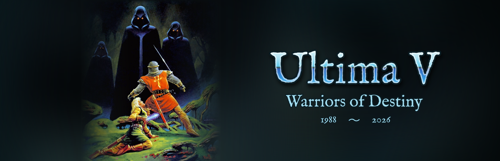
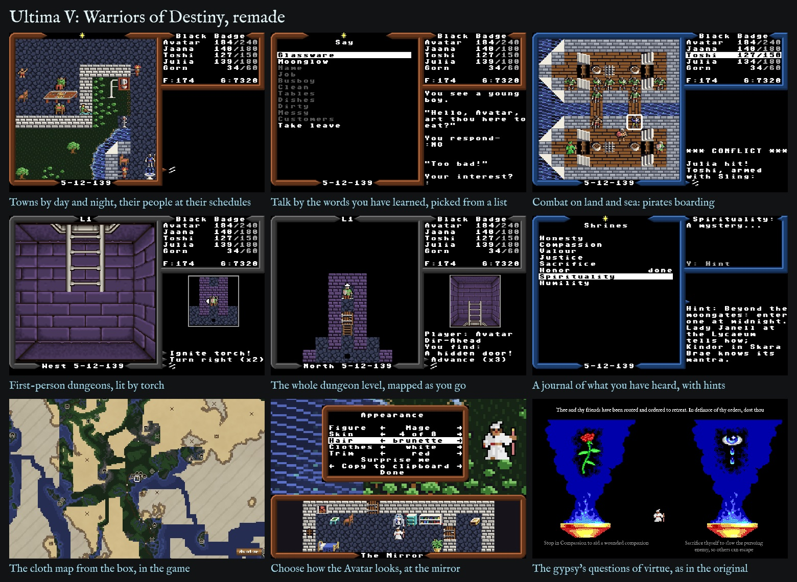
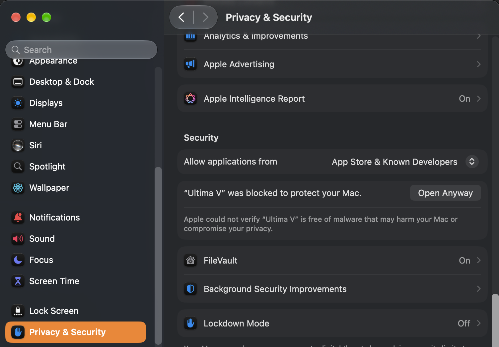
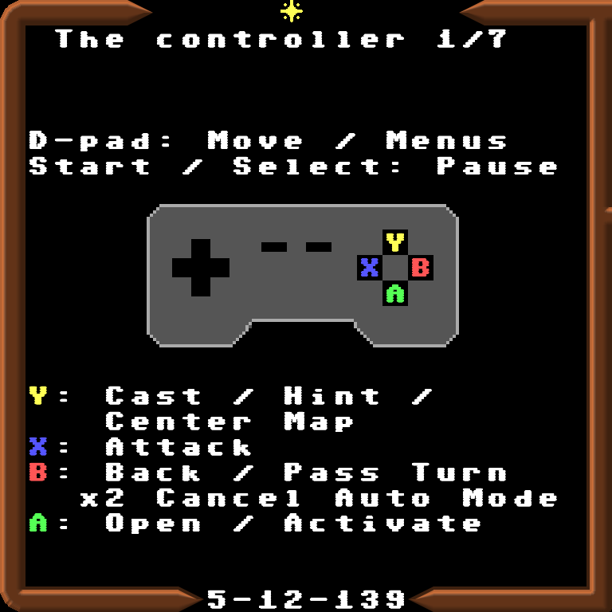

# Ultima V: Warriors of Destiny

*A new engine for the 1988 MS-DOS game, in TypeScript, for the browser,
the desktop, the Steam Deck and Android. Like OpenMW for Morrowind, it
ships none of the PC game: it plays your own copy.*

**Play it:** <https://synthwave-pixel.github.io/ultima5/>

The page itself carries three things of the game's: the Ultima V
Upgrade's music in `web/public/music/`, the Apple II version's tiles, for
the Apple ][ tile set, and the box's painting, for the key art.

![The two looks and their tile sets - Modern with Modern PC, Apple ][ or PC EGA tiles, PC 1988 with PC EGA or Apple ][ - each in the world, a town, combat and a dungeon, and for the Modern look the dungeon's whole-level map](promo/looks.jpg)

- [Installation](#installation) The browser, the Steam Deck, Windows,
  macOS, Linux and Android.
- [New to Ultima V?](#new-to-ultima-v) Get it running and find your feet.
- [Played it in 1988?](#played-it-in-1988) What is the same and what
  is new.
- [Design notes](#design-notes) The thinking behind the changes, for the
  curious and for game designers.
- [Developer notes](docs/developer-notes.md) Building, testing and
  finding your way round the code.
- [Credits](#credits) Whose work the port is built on.

## Installation

Every build asks, the first time, for your own copy of the game: its
folder, its files or a `.zip` (GOG sells it in
[Ultima 4+5+6](https://www.gog.com/en/game/ultima_456), and the Internet
Archive has it). The files are checked and kept on your device, and never
leave it. The desktop app's Scan for game files... finds the copy itself:
beside the app, at home, and where GOG and the Linux launchers install
games.

- **Browser**: <https://synthwave-pixel.github.io/ultima5/>. Nothing to
  install. Chrome, Edge and Android offer to add it as an app, and it
  works offline after the first visit. On iOS use Share, then Add to Home
  Screen.
- **Steam Deck**: the game installs as a Flatpak from Desktop Mode, in a
  few minutes, and then lives in your Game Mode library.
  1. Switch to Desktop Mode: press the Steam button, choose Power, then
     Switch to Desktop.
  2. If the Deck has never had a password, give it one: open Konsole and
     run `passwd`, choosing any password you like. Discover needs it once,
     when it registers the game's repository, and it is also what `sudo`
     asks for; nothing else changes.
  3. Open this page in a browser there (if the Deck has none yet,
     Discover, its app store, installs Firefox) and tap
     [install Ultima V](https://synthwave-pixel.github.io/ultima5/flatpak/ultima5.flatpakref).
     The browser saves a small file; open it from the browser's downloads
     and Discover shows Ultima V with an Install button, and asks for the
     password that first time. Install once: later updates arrive in
     Discover with every other Flatpak's, with no prompt.
  4. Open Steam, still in Desktop Mode. Click Add a Game at the bottom
     left, then Add a Non-Steam Game, tick Ultima V in the list, and click
     Add Selected Programs.
  5. Return to Game Mode with the icon on the desktop, or restart. The
     game is in your library under Non-Steam. If the controls do not
     respond, open the shortcut's controller settings and pick a Gamepad
     template.
  6. The first time you play it from Steam, the game gives its library
     entry its own artwork (cover, banner and logo); Steam shows it the
     next time Steam starts. Artwork you have set yourself is never
     replaced.

  The same link works on any Linux desktop with Flatpak, and the
  terminal line below installs per user with no password at all.
- **Windows and macOS**: the installers on the
  [Releases page](https://github.com/synthwave-pixel/ultima5/releases/latest),
  a Windows installer or portable `.exe` and an Apple Silicon `.dmg`
  (macOS 13 or later; Intel Macs: use the browser). The Windows installer
  then keeps itself up to date; the macOS app and the portable `.exe` say
  when a newer version is out. They are unsigned, so each system asks once:
  - Windows: SmartScreen asks; choose More info, then Run anyway.
  - macOS: the first launch is refused. Open System Settings, choose
    Privacy & Security, scroll down to Security and click Open Anyway
    beside Ultima V. Or, in Terminal, once:
    `xattr -dr com.apple.quarantine "/Applications/Ultima V.app"`. If
    macOS later asks to let Ultima V use the microphone (it can when the
    sound plays through a USB microphone or headset), choose Don't Allow:
    the game never uses it, and the sound plays on.

    

- **Android**: the APK (`Ultima-V-<version>-android.apk`) on the Releases
  page, for handhelds like the AYN Odin or the Retroid Pocket and for
  phones and tablets. Copy it to the device and open it; Android asks once
  to allow installs from that source. Or let
  [Obtainium](https://github.com/ImranR98/Obtainium) install it and keep
  it updated:
  [add Ultima V to Obtainium](https://apps.obtainium.imranr.dev/redirect?r=obtainium://app/%7B%22id%22%3A%22com.synthwavepixel.ultima5%22%2C%22url%22%3A%22https%3A%2F%2Fgithub.com%2Fsynthwave-pixel%2Fultima5%22%2C%22author%22%3A%22synthwave-pixel%22%2C%22name%22%3A%22Ultima%20V%22%7D)
  on the device, or add `https://github.com/synthwave-pixel/ultima5` in
  Obtainium by hand. iOS has no app on purpose: use the browser.
- **Linux without Flatpak**: the `AppImage` on the Releases page. Make it
  executable and run it; it keeps itself up to date.

### Installing from a terminal

On a Steam Deck (Konsole, in Desktop Mode) or any Linux with Flatpak, the
same as the link above, in one line:

    flatpak install --user https://synthwave-pixel.github.io/ultima5/flatpak/ultima5.flatpakref

It registers the game's repository, so `flatpak update` then updates the
game with everything else. To remove the game and its saved data:

    flatpak uninstall --user --delete-data com.synthwavepixel.ultima5

### Your saved game

The game saves itself in the browser's storage (the desktop and Android
apps each keep their own), and resumes on the next visit. Export saved
game and Import saved game (Manage Saves on the title menu, or Settings
in play) carry a game between browsers,
devices and the apps, as text on the clipboard or in a file. To jump
straight to one of the game's sights - Britain, a frigate at sea, the
Underworld, Doom - import one of the [showcase saves](showcase/README.md).

**Back up your saved game.** Browsers can clear a site's storage on their
own: Safari and every other iOS browser delete it after seven days without
a visit, and any browser may drop it when site data is cleared or at the
end of a private window. Export the game now and then. On iOS, add the
game to the Home Screen, which keeps its storage; in a browser tab the
game warns of this once a day.

More on each build - the desktop app under Steam's Game Mode, Android's
full screen, how the installer checks your files, and hosting the web
game yourself - is in [Installing Ultima V](docs/install.md).

### Releases

Every release, with the desktop and Android downloads, is on the
[Releases page](https://github.com/synthwave-pixel/ultima5/releases). The
browser version always runs the newest, and offers to restart when an
update has downloaded. The desktop and Android apps say in the game when
a newer version is out, and offer it - the restart into it, or its
release's page to read and download from.

## New to Ultima V?

Ultima V is a role-playing game from 1988. You are the Avatar, called back
to Britannia to find its missing king, Lord British, and to break the rule
of Blackthorn and the Shadowlords. It is a big, open game: towns to talk
your way through, a world and an underworld to cross, dungeons, magic
mixed from reagents, and a story told mostly through what people say to
you.

**What you need** is a copy of the game - GOG sells it in
[Ultima 4+5+6](https://www.gog.com/en/game/ultima_456), with Ultima IV and
VI, and the Internet Archive has it. This engine reads everything (every
word, picture, map and conversation) from those files, so none of the game
is in it.

**To play**, open <https://synthwave-pixel.github.io/ultima5/> in a
browser. The first time, it asks for the game's folder, its files or a
`.zip` (the desktop app can find them itself: Scan for game files...);
they are checked and kept in your browser, and never leave your device.
There are also builds for Windows, macOS, Linux, the Steam Deck and
Android handhelds: see [Installation](#installation).

**Controls.** A controller, the touch pad or the keyboard all work, and
the d-pad, A and B are enough to play with: A opens a menu of what you can
do where you stand, B backs out, and every question is a box to choose
from. A keyboard works as a controller, its keys laid out as an emulator
lays them (Z is A, X is B):

| Controller | Keyboard | What it does |
|---|---|---|
| D-pad, left stick | Arrows, W A S D | Walk; move through a menu (left and right turn a page in a long list) |
| A | Enter, Z (Tab at the prompt) | Open the menu of what you can do here; choose |
| B | Space, X, B (Escape in a menu) | Back out; at the prompt, pass a turn; leave a won fight |
| X | Q, C, / | Attack (Fire aboard a ship or beside a cannon) |
| Y | E, V, Y, . (full stop) | Cast; in the Journal, a hint; on a world map, back to the party |
| Start, Select | Escape at the prompt | Pause menu |

**Y for a hint, and home on the map.** In the Journal, Y gives a hint for
the line the bar is on: where a shrine, dungeon or Flame is and who knows
what it wants, never the mantra or the Word itself. On a world map, Y
slides the map back to the party, wherever the d-pad has taken it.

At a yes-or-no question Y and N answer too, a number can be typed as
well as dialled, and a name is typed. Classic input (Gameplay) makes every
command a letter again, as in 1988.

**Starting out.** Choose Create New Character. You pick a name (or roll
one), how you are addressed (Lady or Sir), and how your Avatar looks, in a
bedroom before a mirror. Then Thine Adventure asks how hard a game you
want - Modern is the recommended one - and a gypsy's questions about
virtue shape your character. The game begins at Iolo's hut, with Shamino
and Iolo beside you.

**When you are stuck**, look in the command menu (A, or Enter or Tab):

- **Journal**: how the quest stands, and the clues townsfolk have given.
  Y on a line gives a hint.
- **Map**: the cloth map, with what you have seen painted over it.

or open the Pause menu (Escape, Start, or the pause button on the touch
pad):

- **Tips** for a new player: first steps, food, healing, magic, talking,
  dungeons, virtue, travel and the quest.
- **Help**: short pages on the controls, fights and dungeons.
- **Cheats**, if you would rather skip the grinding.

The game saves itself when you enter or leave a town, castle, hut or
dungeon, and says "(saved)"; you can also save from the Pause menu. It
keeps the seven saves before the last, and when all is lost you can go
back to any of them.

**More than one character.** Create New Character adds a character
beside any you have; it never replaces one. With two or more, Journey
Onward asks whose journey it is, the one played last first, and that
list can also delete a character; so can Delete Character under Manage
Saves on the title menu, even the only one. Up to eight characters are kept. Each character has their own saves
and their own settings, so people sharing a device each play their own
game their own way.

## Played it in 1988?

Everything of the 1988 game is here, and the rules follow the
reverse-engineered source of the DOS game,
[u5d](https://github.com/wonst719/u5d), with its modern build's bug
fixes. Everything new is optional. [What is new, in full](docs/features.md)
has the whole list; the highlights:

- **Two looks.** *Modern* (the default) redraws the screen at four times
  the EGA's size, with three sets of tiles: *Modern PC* (1988's own art,
  taken from your files, cleaned up and toned), *Apple ][* and *PC EGA*
  (1988's tiles exactly). *PC (1988)* is the 1988
  screen as it was, with its own tiles or the Apple ][ set. The
  PC speaker sounds are there too, beside new chip-tune ones, and the
  Ultima V Upgrade's music plays where the Upgrade played it, in four
  soundtracks - Classical, Electronic, Ambient and the Upgrade's own; the
  Music and Sound FX levels are set in the Pause menu.
- **No more guessing at commands.** Menus offer what makes sense where you
  stand, and "Blocked!" is kept for walls and water. Walking into a chest
  searches and opens it, into a foe attacks, into rocks climbs them, into
  a door opens it (jimmies it, with a key), into the wall that hides a
  dungeon room's secret way pushes it. Classic input makes every command
  a letter again, as in 1988.
- **Conversation by what you have heard.** On a controller, instead of
  typing keywords you pick from the words you have actually learnt, and
  only the ones the game answers to. Words from a guide can be added in
  Cheats; Classic input still lets you type anything.
- **A journal, maps and a dungeon map** that fill in as you play, kept
  with the save.
- **Your own Avatar** (Modern PC): five figures and your choice of skin,
  hair and clothes, changed at any mirror. The old "Male or Female?" is
  now "How art thou addressed?", since that is all it ever decided.
- **One setting for the rules**: Story, Modern or Classic. Modern (the
  default) lets poison and hunger wound rather than kill, shares
  experience, keeps back your last dagger or spear, adds a little to
  armour, lets the party step over the chests and loot a fight leaves,
  and eases sleep, charm and what a fight can breed - a daemon that
  possesses one of the party is cast out again. Story eases it all
  further; Classic is 1988's game as the Apple II plays it. [The rules
  side by side](docs/features.md#difficulty-and-options).
- **A fight that tells you more**: what each bow or thrown weapon has
  left ("Bow x23:"), a warning before a shot that might hit an ally,
  Switch Weapon to swap between a member's melee and ranged arms, and
  Auto combat that knows a charmed friend from a foe - for the whole party,
  or for everyone but the Avatar while you play the Avatar yourself.
- **Some old bugs fixed**: armour protects (in the 1988 DOS game it did
  nothing), a creature's blow is rolled as on the Apple II rather than
  always its whole attack, the regalia no longer lose their power to a
  spell or a night's rest, the Glass Sword shatters as it should, and a
  creature summoned onto a crowded field no longer haunts it as a
  phantom.
  [Fixing the 1988 game](docs/fixing-1988.md) tells how they were found,
  down to the original Apple II disks.

## Design notes

The port's aim is the 1988 game, played the way a modern player expects,
without giving up what made it itself. A few principles decide most
things:

- **Ship none of the PC game.** Like OpenMW, the engine reads everything from
  the player's own files - even the Modern PC art is derived from the
  original tiles as the game runs: lifted off their ground, toned, and
  repainted through small per-figure rules, so the Avatar's skin, hair and
  clothes can be recoloured without redrawing a pixel. The tile-by-tile
  record is in [standard-originals.md](docs/standard-originals.md). The
  Apple ][ tile set is the exception: the Apple II version's own tiles,
  which a player of the PC game would not otherwise have.
- **A controller is enough.** Every choice can be made with the d-pad, A
  and B. A prompt is always a menu, never a wait for a button you would
  have to know about; that one rule reshaped the commands, the shops, the
  spellbook and above all conversation.
- **Never make the player guess, and never spoil.** The word menus offer
  only words the player has heard, and only ones the game answers to;
  the journal's hints say where and who, never the mantra or the Word.
- **Keep 1988 one setting away.** Changes to the rules are options, with
  the original as a choice (Classic input, the Classic rules, the PC
  (1988) look). Bugs that robbed the player are fixed; quirks that are just
  flavour are kept.
- **Say what a choice does.** "Male or Female?" only ever chose the words
  the Avatar is addressed with, so it now asks exactly that. Every
  setting explains itself at the foot of the list.
- **Measure before changing.** The figures' animation pace was worked out
  from the DOS game's own wait loop: the Modern look moves them
  at the pace of a 1988 XT, the PC (1988) look at an AT's.

[art-brief.md](docs/art-brief.md) is the brief for an artist taking the
Modern look's art further. The modern play and the builds follow the
[ultima3](https://github.com/synthwave-pixel/ultima3) port.

## Credits

The engine's code is under the MIT licence: see [LICENSE](LICENSE). The
PC game itself is not included, and remains its owners'; the engine plays
the player's own copy.

- **The ultima3 port**
  ([synthwave-pixel/ultima3](https://github.com/synthwave-pixel/ultima3)),
  the modernized version of LairWare's Ultima III, whose modern play and
  builds this port follows, and whose Ultima III art and chip sounds it
  borrows (MIT, Copyright (c) 2025 Leon McNeill; see [LICENSE](LICENSE)): its
  Standard border caps (`web/public/graphics/standard-caps.png`),
  its Standard figures and painted grounds (`web/art/standard/u3/`, from
  which `npm run tiles` draws many of the Modern look's tiles in
  `standard-tiles.png`; see [its note](web/art/standard/u3/README.md)),
  and its Standard sound effects, for the effects the two games share
  (`web/src/audio/chip3.ts`).
- **The box's painting**, by Denis Loubet for Origin Systems (1988): the
  key art - Steam's library artwork, the boot screen, the banner above
  (`art/`, `web/art/cover/`). It remains its owners'.
- **The Apple II tiles** of the Apple ][ tile set
  (`web/public/graphics/apple2-u5-tiles.png`): Ultima V's own, drawn by
  Origin Systems for the Apple II version (1988), read off its Program
  disk by `npm run apple2` (`web/tools/art/apple2.ts`). They remain their
  owners'.
- **LairWare**, and Leon McNeill, whose Macintosh port of Ultima III,
  and its source ([beastie/ultima3](https://github.com/beastie/ultima3)), posted in 2025, the ultima3 port grew from - and so,
  through it, this one. Thank you.
- **The fonts** in `web/public/fonts/`: IM Fell English (Igino Marini),
  Sixtyfour (the Sixtyfour Project Authors) and UnifrakturMaguntia
  (j. 'mach' wust, after Peter Wiegel), each under the SIL Open Font
  License 1.1, whose text is beside it; and Britannian Runes II, whose
  maker is not known and which comes with no licence of its own, found
  through [The Almighty Guru's Game Font Database](https://www.thealmightyguru.com/GameFonts/Series-Ultima.html)
  (`SOURCE-britannianrunes.txt`).
- **The music**: the
  [Ultima 5 Upgrade](https://exodus.voyd.net/projects/ultima5/)'s, from
  [The Exodus Project](https://exodus.voyd.net/), by Michael C. Maggio
  (Voyager Dragon) - its arrangements of the Apple II and Commodore 128
  score, composed for Origin Systems ([its source](https://bitbucket.org/mcmagi/ultima-exodus/));
  see [web/public/music/README.txt](web/public/music/README.txt). The
  port's soundtracks re-voice and re-arrange those tunes. Its Original
  version is rendered through **MuseScore General** (MIT): FluidR3 by
  Frank Wen, FluidR3Mono by Michael Cowgill, adapted by S. Christian
  Collins, with instruments by Ethan Winer and Michael Schorsch - its
  notices in [MuseScore_General_License.md](web/public/music/MuseScore_General_License.md);
  rendered by [SpessaSynth](https://github.com/spessasus/spessasynth_core)
  (Apache-2.0), which is not shipped.
- **u5d** ([wonst719/u5d](https://github.com/wonst719/u5d)), the
  reverse-engineered source of the DOS game, whose routines the rules
  follow.
