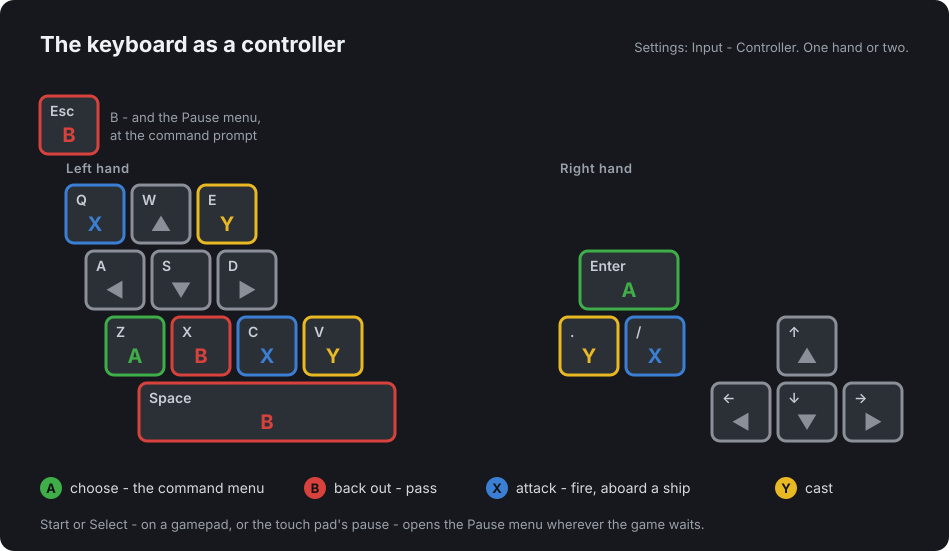

# What is new, in full

Everything of the 1988 game is here: the title and character creation,
the towns, Britannia and the Underworld, conversations and shops, combat
and all 48 spells, the first-person dungeons and their rooms, the shrines
and the Codex, Blackthorn, the Shadowlords, death and the end.

Everything below is new, and all of it is optional. The
[README](../README.md) gives the short version; this is the whole list.
The last section, [Under the hood](#under-the-hood-how-the-modern-look-is-drawn),
describes how the Modern look is drawn.

- [Your game files](#your-game-files)
- [Looks and sound](#looks-and-sound)
- [Character creation](#character-creation)
- [Controls and menus](#controls-and-menus)
- [Conversation: what thou hast heard](#conversation-what-thou-hast-heard)
- [The party panel](#the-party-panel)
- [Magic](#magic)
- [Dungeons](#dungeons)
- [Difficulty and options](#difficulty-and-options)
- [Journal, map, help, tips and cheats](#journal-map-help-tips-and-cheats)
- [Fixes to the 1988 game](#fixes-to-the-1988-game)
- [Saving](#saving)
- [Under the hood](#under-the-hood-how-the-modern-look-is-drawn)

## Your game files

- **Scan for game files**: the first time the game starts it asks for the
  player's copy of MS-DOS Ultima V, and Scan for game files... looks for
  it. The desktop app looks beside itself, in the home folder, and where
  GOG and the Linux launchers install games (GOG Games, GOG Galaxy,
  `/Applications`, Heroic, Lutris and Wine), for a folder named like
  `u5`, `Ultima 5` or `Ultima V™.app` a few levels down; on macOS it keeps
  out of Desktop, Documents and Downloads, so the system asks nothing. The
  web game reads the site's `gamedata/index.json`, a list of the files'
  names in `gamedata/` beside the page, and fetches each: a copy put
  there by whoever hosts it ([Hosting it yourself](install.md#hosting-it-yourself)),
  or, on the dev server, which makes the index itself, the developer's
  own. A copy whose every file is one of the known
  releases' is installed at once and the game starts; a modified or
  incomplete copy is only named, for the player to drop or choose if they
  mean to. `?autoscan=true` on the address scans as the installer opens.
- **Dropping or choosing it**: the folder, its files or a `.zip` of them
  can be dropped on the page or chosen instead, a modded copy included
  (the game says what differs, and installs it when told to). On Android,
  Choose folder... opens the system's own folder picker, which needs no
  storage permission.
- **By controller**: the installer is a menu like the rest of the game.
  A highlight starts on Scan for game files... (Choose folder... on
  Android); the d-pad, the left stick, the arrows or W A S D move it, A,
  Enter or Space presses, and B or Escape backs out of the "Install
  anyway / Choose again" question. The gamepad is read only while the
  installer is up, so a Steam Deck in Game Mode or an Android handheld
  gets to the game without a mouse. (A browser lets a file picker open
  only from a key, click or tap, so there Choose files... wants Enter or
  a tap; Scan needs neither.)
- **Kept in the game's storage**: the files are copied in once and
  checked at every start; Remove game files (Manage Saves, on the title menu) forgets them, and
  the installer comes up on the next start.
- **Its own boot screen and Steam artwork**: while it loads, the game
  shows its key art (the ankh before three Shadowlords) at its own
  320 by 200. Added to Steam as a non-Steam game, the desktop app's
  first launch from that shortcut gives the library entry its cover,
  banner, hero and logo: copied into Steam's artwork folder for that
  shortcut, in the account that has it, never over artwork already there,
  once (a later launch does nothing, until an update brings new artwork:
  then the pictures still as the game put them are replaced, the player's
  own and any they have cleared left alone). The hero keeps its figures
  clear of the Steam Deck's status bar across its top. The boot screen
  and the library's pictures are drawn at the game's grain, pixel by
  pixel as its screen is: the boot screen and the hero the game's own 320
  pixels across, the capsules as coarse as their lettering lets them be,
  with the game's scanlines, one to a row of pixels (the logo, laid over
  the hero, without; the icon smooth). Steam shows them
  when it next starts. Anything in the way - no Steam, a folder it may not write - is
  passed over without a word.

## Looks and sound

- **Two looks and two sounds**, chosen in Settings (UX) and in the Pause
  menu and Settings (Sound FX).
  *Modern* (the default) is the port's own screen, at the ultima3 port's
  scale: every one of the 512 tiles redrawn, creatures standing on the
  ground rather than in black squares, and chip-tune effects (pulse,
  triangle and noise) in the spirit of the originals. The ones a turn
  repeats are kept quiet and a little different each time, and the music
  is lowered under the long ones. Where the DOS game was silent, or one
  sound served two things, the Standard set has the ultima3 port's too: a
  torch lit, a ladder climbed up or down, a horse mounted and its hooves,
  a member's death (a man's voice and a woman's) and the party's, a fight
  begun, a cactus's prick, a fire field, a door opened, the guards called,
  an electric field, the Codex's voice, and a monster's own blow and
  spell. A waterfall is heard as water is, on and on: a soft roar with
  the babble of its bubbles under it, swelling and easing of its own
  accord and never on a beat, rising as the party comes near and louder
  the nearer, dying away as it goes; it never lowers the music, nor does
  a fountain. *PC (1988)* (UX) and *Original* (Sound FX) are the 1988 PC
  release's EGA tiles and screen, and the PC speaker as the DOS game drove
  it.
- **A mixer**: Music level and Sound FX level (the Pause menu, and
  Settings at the title), each Off or 10% to 100%, dialled and heard as it
  turns; Sound FX chooses Standard or Original. Settings from before carry
  over (music off is none; Sound FX off, none of the Standard set). The
  Pause menu and Settings pause the music where it is - it goes on from
  there after - but for the Music and Music level lines, where it plays
  while the bar is on them, each soundtrack heard as it is chosen; the
  menus' own clicks are heard as they are made.
- **Three sets of tiles** for the Modern look (Settings' Tiles), as the
  ultima3 port has its sets:
  - *Modern PC* (the default): the 1988 game's own land, figures and
    furniture, taken from the player's own tiles as the game runs, lifted
    off their ground, toned to the Standard palette, and redrawn where
    the original was a blob (rubble, bones, a ship's rail). Paths and
    dirt edges keep the original's specks; the shores are drawn from the
    map on the EGA's grid, with a fringe of sand along every grass coast,
    lake and river bank. The towns and buildings are the Modern look's own.
  - *Apple ][*: Ultima V's own Apple II tiles, all 512 of them, in the
    Apple II's six colours, each tile whole on black as the Apple drew
    it. The game was drawn for the Apple II first and its PC tiles after;
    the tiles come off the Apple version's Program disk (`npm run apple2`)
    and are shipped with the page, so the PC game is all a player needs.
  - *PC EGA*: the 1988 PC game's tiles exactly, from the player's own
    files, each whole on black as the EGA drew them, with the party out in
    the world as 1988's single icon - inside the Modern screen, with its
    lettering, its runes read and its panels.
- **Tiles for the PC (1988) look**: *PC EGA* (1988's own) or *Apple ][*
  (the set above), in the 1988 screen with its own lettering. Each look
  keeps its own choice of tiles.
- **Outlines** (Settings): a fine black line round every person and
  creature in Modern PC, to see them on busy ground.
- **Effects don't stop the game.** An effect plays and the game goes on,
  as the ultima3 port's do. The DOS game stood still as long as its
  speaker sounded (a first-circle spell held the view flashed for nearly
  two seconds); now a spell flashes for a tenth of a second, and a hit is
  that port's burst growing over the one struck, red for a blow or a
  missile and blue for magic. Only a sound that is itself the timing (a
  tune played note by note, the whirlpool, the earthquake) is waited out.
- **The party on foot** is drawn as its members, tinted by their state:
  out in Britannia and the Underworld, the first living member alone,
  walking (with the Apple ][ and PC EGA tiles, 1988's single party icon);
  in a towne, the first living member with the others after it in a line,
  on the squares it walked. In the Modern look the figures move at the
  pace of a 1988 XT, half that of the PC (1988) look, which keeps an AT's.
- **The runes are read for you.** A sign, the runic speech, the sextant's
  reading and the rest are printed in runes, and after a second each rune
  gives way to its English, in a wave across what was printed; a key
  finishes it at once. Read again, the runes are runes again. A word said
  in runes reads blue if it is good (a mantra), red if it is evil (a
  dungeon's Word or name) and grey otherwise. A sign on a
  dungeon's wall is grooved in dark red into a bolted plate on
  the stone, rather than printed on 1988's white plate, and its English
  is cut in the Modern look's own lettering, bold enough to read against
  the plate, half as large again
  as 1988 printed it, its lines broken between words where they would run
  off the wall. It stays in its runes until the party reads it - walking
  into it, or Read sign - then gives way to its English in the same wave,
  a key held against it letting it run on, and is runes again once the
  party has stepped away. Without the party's light, a sign is not seen.
- **The story pages** (the introduction, the gypsy, the ending) are set in
  a real book face, their words still read from the player's files, with
  the first letter dropped two lines in copper blackletter.
- **Music.** The DOS game had none; the Ultima V Upgrade (The Exodus
  Project, 2001) gave it the Apple II and Commodore 128 versions' songs as
  MIDI, and they play where the Upgrade plays them, read from its driver
  and patches (`web/src/game/music.ts`). Its sixteen tunes come in four
  soundtracks, chosen in the Pause menu (Music):
  - **Classical** (the default): the tunes arranged anew for a string
    orchestra, a full orchestra, a Renaissance consort, a Celtic band
    and a pedalled piano;
  - **Electronic**: analog synths, a drum machine and a synth piano -
    after the Stranger Things score, 80s New Order and The Cure, and
    Tron: Legacy;
  - **Ambient**: the same notes in soft synthesized voices - pads,
    glassy bells, mallets, a round bass, breathy winds
    (`web/src/audio/remaster.ts`; called Remastered in the code);
  - **Upgrade (2001)**: the Upgrade's General MIDI arrangements on
    sampled instruments, as a wavetable card played them (MuseScore
    General; called Original in the code).

  Electronic and Classical were chosen tune by tune and place by place
  (`web/src/audio/soundtracks.ts`): a tune heard over and over - the
  overworld, a fight, a town - has several arrangements, one picked at
  random each time it starts, never the one it played last, and gentler
  ones, eased where the ear is most sensitive; the title, a shrine and the
  two stories have their own; Britannia's change at dusk and dawn, by
  night darker; Blackthorn's castle is ominous. The three tunes heard once
  - the character's making, the reunion, the proclamation - rest five
  seconds before they come round, and Joyous Reunion is rewritten from
  Lord British's own theme (the Upgrade's echoed the Wedding March). All
  are rendered to files before the game is built (`npm run music`:
  tools/music/), each a loop without a seam, set at one loudness, in
  48 kbps Opus; a tune is fetched the first time it plays and kept, and a
  change of tune crossfades. Where a file cannot be had, another of the
  tune's plays, then the Ambient's, then the Upgrade's. A tune not
  yet heard online is silent offline on the web (the apps carry them
  all); one rendered again is a new file, so a player never keeps the
  old.

## Character creation

- **The name** starts as one of the port's own names, with the bar on
  "Suggest a name"; A rolls another. Type your own, or Continue with the
  one shown. Starting over when a game is saved warns that its Avatar, by
  name, is lost. The title's music plays on while the character is made,
  and its flames flicker behind the questions.
- **"How art thou addressed?"** Lady or Sir, where the original asked
  "Art thou Male or Female?". It only ever chose the words the Avatar is
  spoken to with (plus a death cue and the stats screen's symbol), so the
  question now says what it does. It is a box of its own: nothing is
  chosen until left or right is pressed, and B goes back to the name.
- **Make your own Avatar** (Modern look, Modern PC tiles): five figures
  (fighter, mage, bard, jester, shepherd), eight skin tones, eight hair
  colours and twelve hues, white, grey and black for the clothes and their
  trim, chosen in the
  bedroom of the title's first scene before its mirror, which reflects
  you, and shown large above it, out in the world: a patch of Britannia
  grown behind the menu, the Avatar on its grass. Each colour can be
  left at its default. With a hair colour, the fighter's and the bard's
  helms become hair and the jester's hood becomes braids (the bells
  kept); without one the hood takes the clothes' hue. A Lady's mage has
  no beard, and the mage's staff takes the trim's colour with the belt.
  On Copy to clipboard the figure stands still, left and right choose
  which step of its walk, and A puts it on the clipboard as a PNG, clear
  behind it (where the browser allows it; otherwise the row says it
  cannot copy). B goes back to the address. Change it later at any
  mirror in a town or castle: look at it or walk into it (with more than
  the Avatar in the party, it asks whose reflection first). Other looks
  and tile sets draw the original Avatar
  and keep your choice for when you switch back. The people of Sosaria
  share one light brown skin in both Modern sets. With the Modern PC
  tiles the title's scenes show the saved game's Avatar as made, waking
  in the first scene's bedroom where 1988 had a shepherd, the mirror
  giving it back.
- **The companions' looks** (Modern look, Modern PC tiles): each of the
  fourteen who may join has colours of their own, where 1988 drew every
  bard alike - the eight of Ultima IV in the colour of the virtue each
  stood for (Mariah's Honesty blue, Iolo's Compassion yellow, Geoffrey's
  Valour red, Jaana's Justice green, Julia's Sacrifice orange, Dupre's
  Honour purple, Shamino's Spirituality white, Katrina's Humility black),
  the six since by where they are found or who they are; the people's
  skin; and a mage's own hair colour, the fighters' helms and the bards'
  hats kept. They are drawn so in the party, in a fight, and where each
  waits in their town to join, and a woman who walks as a mage (Jaana,
  Mariah) has no beard. At a mirror, choose one of the party to change
  their skin, hair and colours - not their trade or their sex, which are
  theirs - kept with the saved game. The fighters' grey plate takes its
  colour as enamel would, the shield the trim's.
- **Thine Adventure**: Modern, Classic (as in 1988) or Story, the rules
  (see Difficulty and options), changed afterwards in Gameplay.
- **The gypsy's questions** are answered on the screen: each answer under
  the bowl of its virtue's card; the d-pad walks the Avatar from between
  the bowls to one, its fire stirring and its answer turning white, and A
  (or Return, or Z) takes it. The PC (1988) look keeps 1988's pages and its
  A and B.

## Controls and menus

- **Input**: Controller, how the game starts, reads the keyboard as a pad
  - W A S D or the arrows walk; Enter or Z is A; Space, Escape, X or B is
  B; Q, / or C is X; E, the full stop, V or Y is Y - and everything is
  reached through the menus, which take the same keys. Classic makes
  every command a letter again, as in 1988. Words and names are typed as
  letters either way, and Y and N answer a yes-or-no question either way.
  With no letters shown, the commands 1988 spelt for theirs read plainly:
  Climb (Klimb), Stats (Ztats), Pick lock (Jimmy), and Dismount, or
  Disembark from a ship (X-it); Classic keeps 1988's names.

  

- **The d-pad, A and B are enough to play with**, as in the ultima3 port:
  A where the party stands opens the commands, B backs out, and a
  question is never a wait for a button the player must know of but a box
  to choose from: Yes and No; a shopkeeper's wares ("A...Ginseng") or the
  choices a question names in words ("Mutton, Ale or Rations?"), read back
  out of what was just said - a healer's arts with their prices ("Heal
  (55gp)", free with the Light at Minoc's), an apothecary's reagents and a
  guild's keys, gems and torches each with its card over the party while
  the bar is on it (how many held, a lot's size and price under that,
  then what it is for); a number dialled in a box, up and down by one
  and left and right by ten; up or down a ladder; the spells that are
  mixed; a Mix line under the reagents.
  Talk, Open and Pick lock from the menu ask no way where only one side
  of the party has someone or something to act on.
  "Which way?" and "Aim" stand on the border while a direction or the
  crosshair is wanted.
- **A harpsichord has a keyboard.** Play (beside one, on any side) or
  walking into it opens nine keys in a box over the map: left and right
  move along them, A plays the key, B gets up, and the number keys 1-9
  play their keys too. Each note's number rises from its key and fades;
  the music pauses while the keyboard is up.
  Played through in Lord British's chamber, the tune closes the keyboard
  and the wall gives way. In 1988 the tune was printed in the Book of
  Lore; here, once Lord Kenneth of Greyhaven's lesson is in the journal,
  a gold dot marks the tune's next key at Lord British's harpsichord,
  until the way is open or the Sandalwood Box is had. Seated at a
  harpsichord, the number keys still play notes, as in 1988.
- **Each button means one thing everywhere.** A (or Tab) opens a command
  menu with what is at hand first, and chooses; B passes or backs out -
  the answer "none" to any question - and a command backed out of spends
  no turn. X (Q or C on a keyboard; the keyboard's X is B) attacks: in a
  fight, with Auto aim on, the foe in reach; aboard
  a frigate it fires the broadside, and beside a castle's cannon, the
  cannon. Y casts, the spell list opening in a fight on the caster's last
  spell, and where words are typed it is the letter picker - in which X
  rubs out a letter and Y switches a name's case, its abc row under
  Space, a press down from it. At an aim the
  button that began it looses it, as A does. Start or Select (or the touch
  pad's pause button, or Escape at the command prompt) opens the Pause
  menu wherever the game waits, and the game carries on where it was. A
  press on a gamepad or the touch pad puts the game in controller mode,
  and a held button does not repeat into a second turn.
- **The command menu** lists what the surroundings call for first, names
  the weapon in hand ("Attack (Bow)") and leads with it when it reaches,
  dims what the party has not the means for - no mixture to cast, no
  torch, no gem, no key - and leaves out what has no meaning where it
  stands. The spells the moment calls for are each a line of it, cast
  without further asking where someone can: a heal while anyone is hurt,
  a cure while anyone is poisoned, a light in the dark. Search heads the
  menu when there is something still to be found beside the party, and
  Ignite torch when a dungeon is dark. What is someone else's, and costs
  karma to take, the menu names Steal: crops and a bite from a plate
  (Get), and Steal from chest for a chest in a town, castle, keep or
  dwelling (Open) - the same commands, the word alone telling the player.
  Get is offered for a thing lying where the party stands - a shard
  Blinked onto, the carpet left there - and A at its "Which way, or
  here?" takes it up from the marked square. Typed commands are
  unchanged.
- **Walking into a thing does what there is to do with it**, and
  "Blocked!" is left for walls and water: gold and other things lying
  about are taken, a corpse is searched, a chest is searched and then, at
  the next bump, opened - or, where the search found a trap, first
  unlocked with An Sanct if someone can cast it, else jimmied with a key,
  else opened as it stands; a badge in the chest's corner shows what the
  search said (a red "!" for a trap, a green tick for none, a blue tick
  once disarmed). In a town, where opening one costs karma, it is only
  looked at, as is a table laid with food. A barrel or footlocker is
  searched and then pushed, a bookshelf searched, a potted plant or
  cannon pushed, rocks and fences climbed (in a fight the rocks a fallen
  gargoyle leaves, on horseback or not), a wall with a nick looked at
  and then searched, the strange walls of a fight dissolved with the
  Sceptre, a door in a fight's room opened (a locked one jimmied, where
  there is a key), a wall with a nick in a fight's room searched (one a
  trigger raises - Wrong's trap), the wall that carries a room's trigger
  pushed (it opens a secret way), and a well, fountain, clock,
  sign (from either square of a shop's two) or mirror looked at. A bumped
  command is made by whoever suits it: a chest searched by the cleverest,
  jimmied by the most dexterous and opened by the hardiest. While foes are
  about, nothing lying about is taken, searched, opened or pushed at a
  bump - in a fight a body, and with the Story and Modern rules loot, is
  stepped over then. Push leads the command menu beside furniture that
  moves, or a room's trigger wall. On a fight's field a fallen member's
  body is drawn over loot, loot over a slain foe's corpse, and whoever
  stands there over all.
- **The log folds a move made again.** A step that prints what the step
  before it printed is counted on the line already there - "North (x6)",
  and under it "Blocked! (x6)" - instead of marching down the log; a turn
  passed again folds the same way, "Pass (x3)". A line too long to take
  its count is cut at its last whole word that fits ("Slow (x2)" for "Slow
  progress!"). Anything else said again is said again in full.
- **In a fight**, walking into a foe strikes it with everything that
  strikes - a spiked helm and each hand's weapon - without asking where:
  at that foe while it stands, then at the nearest foe the blow reaches.
  Walking into a friend strikes past them, at the first foe along that
  line a weapon reaches. Attack from the menu still asks each hand; X is
  Attack in a fight. A caster's last spell heads their menu, and Ztats
  spends no turn. A fight won is left by Leave combat, at the head of the
  menu, and B will not walk away from a field with treasure still on it.
- **Loot and Leave**, at the head of the menu, above Leave combat, once a fight is won: each chest is
  searched by the cleverest, a trapped one unlocked with An Sanct or else
  jimmied once by the most dexterous, and opened by someone a trap cannot
  kill; everything lying about is picked up, and the party leaves. A chest
  no one can open safely is left, and the party stays and says so. No turn
  is spent. However many chests there are, it is said once, together - who
  searched and opened them, a trap that went off, and one line of all that
  was taken ("Taken: 312 gold, 2 potions: Heal, Leather armour") - rather
  than each chest's lines scrolling past; and each sound sounds once, one
  An Sanct's sparkle or one trap's burst however many chests.
- **Rations and reagents**, with a controller, are dialled: how many,
  the dial saying what one is (25 food; a lot of so many of a reagent),
  what the number on it costs of the gold there is, and for a reagent how
  many the party will hold - and going no higher than the party can pay
  for and carry. Classic input asks as 1988 did, a reagent one lot at a
  time.
- **At an armoury**, with a controller, the party says first who is
  buying - each shown with what is in their hands and on their back - and
  the wares are a menu for them, each with its price: what they can carry
  and the party afford in white, what the party cannot afford in light
  grey, what they could not carry in dark grey, in that order. Beside the
  menu is what they have where the ware under the bar would go, "vs" the
  ware, and the numbers that matter - attack, defence, range, weight -
  each with the difference, green where the ware is better, red where it
  is worse, white where it is the same; and under them Too heavy, No
  ammo, 2 hands where a shield would go, and what a weapon brings or loses
  beyond its numbers - thrown, returns, magic, a sure hit, the rings' and
  the amulet's powers, the armour that counts in Doom, and the costs some
  carry (a sword that shatters, one that charms its wielder, one that does
  no harm) - green where the change is a gain, red where it is a cost, the
  costs said first. A Glass Sword has no numbers to weigh: its card says
  1 hit, 1 kill, 1 use, and one in hand is left out of the attack a ware
  is weighed against. A purchase may be readied on the spot, the bar on
  whoever it was bought for.
- **The cleverest of the party does the business** at every merchant:
  the prices are haggled by the highest intelligence of those awake, as
  1988's player arranged by making the cleverest the active member to buy
  and readying the goods on the others after. The merchant still speaks to
  the Avatar, as sir or milady, while the Avatar lives.
- **Thrud of Windemere gives the Jeweled Sword** with the Jewel Shield, as
  he says he will, for the Resistance's password: the DOS file has him hand
  over a crossbow instead, the sword's number written in decimal. Typed, the 1988 lettered
  list is as it was, with what each of the party has beside it.
- **Camp, Sleep and Repair hull**: Hole up is named by what it does where
  the party is - Camp on foot outdoors and in a dungeon, Sleep in a bed
  in a towne, Repair hull on a ship - and Camp leads the menu when a camp
  would be a rest and someone is short of hit points or mana. A
  controller dials the hours, the box saying what they will be - Rest,
  Wait, or Wait (Just Rested) - and the hour they end at ("Until 5 PM",
  "Until midnight"). A bed rests as a camp does, where in 1988 it only
  passed the hours. A rest is taken at the hour it is earned - six hours
  slept, fourteen since the last - and the sleep goes on after it as a
  wait, so a long sleep broken off later keeps its rest (1988 gave it only
  at the end, and none to a sleep broken off). The old man comes to an
  outdoor camp that rested as the Rules have it (below): with the Story
  and Modern rules whenever a member has a level due, which he alone
  grants, and otherwise one time in four but not within two weeks of his
  last; with the Classic, one time in four, as in 1988. He heals the
  party when he comes, as in 1988: full hit points and magic, poison and
  sleep gone. Whoever's bed it is, coming to it while the party
  sleeps, throws the party out of it.
- **Wait**, with a controller, in a towne off a bed: the hours dialled as
  for Sleep, passed standing and awake - no rest - the townsfolk going
  where the hours take them. Someone coming onto the party's square, or a
  guard or foe coming up beside it, ends the wait.
- **Pause**: Escape, either system button on a controller, or the touch
  pad's pause button holds the game - the music and everything sounding
  stop where they are, except a level being dialled, which is heard - and
  offers Auto combat, the music and the sound effects, Gameplay, Settings,
  the help, the cheats, the tips, saving, and saving and leaving off. The
  journal and the map are in the command menu.
  With Auto Pause on, a window that loses focus while the game waits
  opens it too, as does sending the Android app to the background.
- **The title screen** has Settings too (with the music, the sound and
  Gameplay in it, there being no Pause menu there), and its questions (a new
  character over a saved game, the adventure's kind, Journey Onward with
  no game saved) are boxes of their own above its menu.

## Conversation: what thou hast heard

Ultima V asks the player to type: a keyword at a townsman, a mantra at a
shrine, a word of power at a dungeon's mouth. Picking letters out one at a
time is a poor way to hold a conversation, so a player on a controller is
offered instead the words they have learnt - kept as they were heard, in
conversation, on a sign or in a book, and only the words the game answers
to. A few are known from the start, as every Avatar knows them: Lord
British, the answer to who rightly rules Britannia and whom the party
serves (Greyson, Thorne - whose Mantra of Valor hangs on it - Landon and
Wartow); the opening story's Britannia, Blackthorn, the Shadowlords, the
Great Council, the Codex, the Abyss, Iolo and Shamino; and the eight
virtues the gypsy weighs as the Avatar is made. A townsman's menu shows the ones that townsman answers, what has not
been asked first and the name and the trade leading that: white if their
answer has never been heard, grey once it has. A keyword the townsman has
a word of their own for (Chamfort's LAND is Landon, Judge Dryden's PLEA
is pleading) is offered as that word, and not at all until it has been
heard - never as another that only begins the same way ("land",
"please"), which would ask after what the player has yet to learn. The
words a question listens for are offered the same way (Greyson's mantra
is Compassion, not "complex"), and a letter alone, a way of saying yes,
is left to Yes. Every keyword that matters can be reached from what is
heard and read, and every conversation finished - tested
(tests/dialogs.test.ts, tools/talk/reach.ts).

The same list is offered for the virtue and the mantra at a shrine, for a
word of power yelled at a dungeon's mouth, for the lore a barkeep sells,
for a wish dropped into a well, and for the answer to Blackthorn, who
demands a shrine's mantra. At a shrine the virtue and the mantras are
asked in a small box of two columns low in the view, the altar and the
Avatar kneeling there in sight above it, and the box is put away for a
second before each chant; the second and third chants are offered from
the word just chanted. A townsman's own question is answered Yes, No,
or with whatever it listens for that has been heard. One question is a
riddle - Lord Kenneth, teaching the harpsichord, asks for the next notes
of a tune that 1988 printed in the Book of Lore - and is answered from its
answer's own letters in four orders, a wrong one greying once tried. It is
easier than it was, and meant to be.

Nothing is typed at the Say menu, so a controller's player is never left
guessing at words: a word known from a guide is added in Cheats (Add word)
and offered from then on wherever it may be said. To swear at a townsman,
set Input to Classic and type it.

## The party panel

- **In the Modern look** the party's box holds the party and, straight
  under it, food and gold, and the log below runs two lines longer. The
  date is on the map's bottom border - at sea with the wind, in a dungeon
  with the way the party faces. The lasting spell in force is named under
  the party with its turns left ("Protection 17"), and the regalia worn on
  the box's top border ("Crown"). The PC (1988) look keeps the 1988 screen.
- **Names take the colour of their state**: green poisoned, lavender
  asleep, pink charmed in a fight, grey dead, blue when the camp's
  apparition would grant a level. Hit points show as current over maximum
  ("5/240", the current yellow when low and red when nearly gone). The
  state's letter (P, S, D, C) appears on the frame where Settings' Status
  letters asks for it; off by default, the colour telling.
- **The turn's marker** in a fight, the outline round the member whose
  turn it is, takes the same colour as their bar in the panel: their
  state's first, then their hit points' (yellow or red), else white. It
  flashes a dim white for a moment when their blow or shot misses, the
  attack seen to be made where only the log said so.
- **Experience** shows on the panel while the command menu's bar rests on
  Ztats: each member's experience over the next level's, thousands as k
  ("1.7k/3.2k"), blue where a level is due, which only camping brings.

## Magic

- **Magic at a glance.** With the menu's bar on a spell to cast or on Mix,
  and while the caster is chosen, the party panel shows each member's
  mana where the hit points are (a fighter's line grey). The spell lists
  count the mixtures made ("Heal x3"), and while one is open the panel
  shows the spell the bar is on: its words ("Mani"), the mixtures made,
  its cost in mana, its circle (grey where the caster - or, mixing,
  anyone of the party who casts - has not reached it), and its reagents
  with the party's stock of each - all read from the player's files.
  Resurrect's six reagents leave no room for the mixtures' line, which
  its label already counts. The list to cast puts what can be cast now
  first, then the rest greyed, each by circle; the list to mix keeps the
  game's order.
- **Mixing on a controller** is the spell and then how many, the spinner
  going no higher than the reagents make; the recipe is the game's own, so
  a mixture is never wrong. The keyboard mixes as in 1988, the reagents
  ticked by hand. A spell backed out of at its own question keeps its
  mixture and magic points, and so does one refused for too little mana
  (1988 spent the mixture all the same).

## Dungeons

- **The corridor** is one set of walls in grey stone, and each of the eight
  dungeons is told apart by the light in it - Deceit, Wrong and Hythloth
  cold and violet, Despise, Covetous and Shame green with damp, Destard
  and Doom red with what burns below. A creature in a corridor is 1988's own
  picture of it, drawn anew for each distance and twitching and flapping
  as 1988's did, in the Modern colours and under the dungeon's light; on
  the maps it is its figure. In the dark, with no light carried, what
  gives a light of its own - a skeleton's eyes flashing red, a field's
  crackle - is all there is to see. A pit trap drops the party out of the view: it slides up
  and away over half a second, faster as it falls, black behind it,
  before the level below is drawn - the small view beside the whole-level
  map, inside its frame, when that is up.
- **The dungeon map**: the graph paper of old, showing the level's eight
  by eight grid of cells as far as the party has walked with a light (in
  the dark it shows only the cells round the party, felt for, and keeps
  none of them), with the mark of what each cell is and which way the
  party faces, and the level's creature where the party can see it (down
  a lit passage or round a corner beside it - never through rock or a
  closed door - or next to it in the dark, felt for). In the Modern look it is
  drawn in the look's own tiles, edge to edge a pixel to a pixel:
  cobbled passages, the rock the wall in the dungeon's light, ladders,
  chests, fountains (turning), doors and treasure on them, a pit the
  original's black box, and rubble the dungeon's own - bones, or a caved
  in passage. It sits under the party panel, five cells a side round the
  party, over the top nine rows of the log (six go on below); the Map
  command switches to the whole level, where the d-pad walks by the
  compass (a press the way of something to act on - a ladder, a chest, a
  fountain, the creature, rock to search - only turns to face it, and
  the next acts): the party in the middle and the level round it, moving
  with them. The levels are packed into a wrapping grid of eight by
  eight, but only two truly loop round (Shame's seventh, Doom's fifth):
  on the rest the map unrolls the passages from where the party stands,
  each cell drawn once where it really lies, and on those two the level
  repeats round the party as it goes on for ever. The PC (1988) look
  keeps its map over the first-person view - Off, in the Corner, or the
  Whole view, chosen in Settings.
- **The menu names what is here or ahead**, its way already chosen: Klimb a
  ladder or a pit, Open or Jimmy a chest, Get its treasure, Drink at a
  fountain, Read the sign on the wall ahead, Attack the creature before
  the party, and Search where there is something it could find. Walking
  into a wall, rubble or a skeleton searches it (a hidden door is found
  so), and into the creature attacks it.

## Difficulty and options

- **Rules**, one setting in Gameplay, and Thine Adventure's question when
  a character is made: **Story**, **Modern** (how the game starts) or
  **Classic**. Classic is 1988's game as the Apple II has it - where the
  DOS game and the Apple II differ, the Apple II's design, as
  [Fixing the 1988 game](fixing-1988.md) tells. Modern eases it, and
  Story more. In full:

| | Story | Modern | Classic (1988, the Apple II) |
|---|---|---|---|
| **Poison** | Stops at 1 hit point | Stops at 1 hit point | Can kill |
| **Hunger** | Never hurts, nothing said; the food is eaten all the same | Stops at half the party's hit points | Can kill |
| **A kill's experience** | Shared among the living | Shared among the living | All the striker's |
| **The last dagger or spear** | Kept back | Kept back | May be thrown away |
| **Added to armour before a blow's roll** | +10 while the party has food, +3 with none | +3 | +0, armour alone |
| **A gargoyle's, daemon's or dragon's blow** | Half its attack to all of it | Half its attack to all of it | 1 to its attack |
| **Any other creature's blow** | 1 to its attack | 1 to its attack | 1 to its attack |
| **A sleeper hit, and standing** | An even chance to wake | An even chance to wake | Sleeps on |
| **A sleeper, each turn** | Wakes 1 in 10 | Wakes 1 in 10 | Members 1 in 16, creatures 1 in 17 |
| **The charmed or possessed** | May throw it off each turn, on the roll that resisted it | May throw it off each turn | Held the fight through |
| **A daemon that possessed one of the party** | Cast out beside them when it ends: one gated in during the fight with 1 hit point, a blow from gone; one the fight began with weakened as with the Modern rules | Cast out beside them, weakened by how far the member's roll to throw it off came under its mark (2.5% of its hit points a point - the cleverer the member, the harder), or by a fifth when the possession ended otherwise | Gone with the possession |
| **A pass-out** (nobody unpossessed left standing, a Shadowlord slain or fled) | Frees the first possessed member | Frees the first | Frees every one |
| **A summoner gates in a daemon** | 1 turn in 8 | 1 turn in 8 | 1 turn in 32 |
| **Copies and summons a fight allows** (both sides together) | 6 | 12 | No bound |
| **Times a creature the fight began with may divide** (a copy one fewer) | 2 | 3 | No bound |
| **A graze divides a gargoyle or slime** | No | No | Yes |
| **The mimic's armour** | 3 | 3 | 8 |
| **A chest, or loot lying, in a fight** | Walked over, as a body is - by either side; walked into to be opened or taken once no foe stands | Walked over, as Story | In the way, until it is dealt with |
| **Auto combat and one of the party charmed against it** | Lets them be | Lets them be | Strikes them |
| **Sleepers when an ambushed camp's fight is left** | Wake | Wake | Sleep on (out in Britannia, till a towne, a spell or the next camp) |
| **The old man at an outdoor camp that rested** | Whenever a level is due; else 1 in 4, not within two weeks of his last | As Story | 1 in 4, every camp |

The same under all three: armour worn counts (the DOS game's armour did
nothing); a creature's blow is rolled, never its whole attack every time;
resisting a charm is intelligence against intelligence; Negate Magic and
the Crown stop a creature's magic; the sleep potion, the Glass Sword and
the regalia work as they should; and the random numbers are random. Every
other hurt in the game kills as it always did.

- **Switch Weapon** (a fight's command menu; W on the keyboard): a member
  takes up the other of the melee and the ranged arms they last held - a
  sling, bow, crossbow, magic bow or flask of oil is ranged, every other
  weapon melee, one to throw among them - and from no weapon at all (bare
  hands, a shield alone, a bow with no arrows) their melee arms. While the
  bar is on it, the panel shows the arms it would take up, as Ready shows
  an armament. Where what was held is gone, what is left is taken up and
  the rest chosen, and it says why: "No arrows - Crossbow!". The choice goes
  by the member's style - two weapons, weapon and shield, or both hands to
  one - as their starting arms show it (Iolo's two blades, Shamino's sword
  and shield), or their class where those leave a hand empty (a bard's two
  weapons, anyone else's weapon and shield; the Avatar weapon and shield),
  or the melee arms the player last readied by hand: the most damage, then
  the most defence, then the lightest. Ranged goes the magic bow, crossbow,
  bow, sling, then oil, as there is ammunition. Never the glass sword, the
  Chaos sword, or the jewelled sword and shield, which do nothing in a
  fight. With nothing to take up it says so, and no turn is spent.
- **Thrown weapons**: the Classic rules leave a hurled dagger or spear
  where it lands, as the original does; the Story and Modern keep back the
  party's last one. Arrows, quarrels, oil and the throwing axe are spent
  either way. At
  a neighbour, across a corner too, a dagger, spear or throwing axe
  strikes from the hand: the same roll and the same blow, but nothing
  flies, and a miss strikes nobody beside the foe (1988 threw it there
  too). Flaming oil is thrown, to burn. A bow, crossbow or thrown weapon
  is named in the fight with what is left - "Bow x23:", "Spear x2:" (the
  one in hand and the spares) - and the last arrow or quarrel says so as
  it puts the bows or crossbows away.
- **Clone** (In Quas Xen) starts its crosshair on the nearest friend - a
  copy is to fight for the party, and one of a foe would fight against it.
- **Auto aim**, on to begin with: X in a fight (Q or C on a keyboard), and
  walking into a foe,
  strike without the crosshair - each weapon at the foe walked into, else
  the nearest foe it reaches. A shot or a throw that misses flies on to a
  square beside its foe and strikes whoever is there, friend or foe (as in
  1988), so X passes over a foe with one of the party's side beside it
  (a dagger, spear or axe at a neighbour, struck from the hand, strays
  nowhere, and reaches a foe over a wall or tree as aiming by hand does);
  where every foe in reach has, it says "Iolo might hit ally, confirm?" and
  X again, straight away, shoots. Off, every blow is aimed by hand.
- **Auto combat** (Pause menu): Off, Allies or All, a press turning it on
  through them. *All* plays the party, and the creatures summoned or
  charmed to its side, until a key is pressed. *Allies* plays all of them
  but the Avatar, whom the player plays: keys are the player's then, and
  one pressed in an ally's turn is let go rather than handing the party
  back; once the field is won the allies pass, and the Avatar leaves it
  (Leave combat, Loot and Leave, a room's exit) - or, with the Avatar
  fallen, asleep or charmed, the allies leave it as All does. While it
  plays a turn, in either, "Auto" stands in the middle of the map's top
  border, over the sun and moons a fight out of doors shows there;
  Start, Select or Escape opens the Pause menu, where Auto combat can be
  turned off or changed; B twice in quick succession turns it off ("Auto
  combat off"); and every other button pressed is let go, so none is left
  over to act in a turn of the player's. One of the party charmed against it is a foe to
  strike with the Classic rules, as in 1988; with the Story or Modern it is
  let alone, auto combat fighting the creatures and waiting while the charm
  wears off - never a blow at the charmed Avatar; but where the one who
  charmed them stands unseen (a Shadow Lord that disappears holds its
  charm, and the charmed strike on), the fight is handed back to the
  player. A member climbs the rocks
  a fallen gargoyle leaves where they lie on the way to a foe. A member
  Switches Weapon to their ranged arms when no foe is within reach or three
  squares - never of itself to the party's flasks of oil - and back to
  melee with a foe beside them or the last arrow loosed; it strikes only
  where Attack would reach a foe, a shot or a throw along a clear line -
  and with the hand Attack asks first, where none reaches a creature (a
  spiked helm swung before the axe at a charmed friend), else it closes
  in. Fights it goes nowhere in for thirty turns are handed back: All is
  turned off, and Allies held for the rest of that fight alone.
- **Gameplay** (Pause menu): input, Auto Pause, the rules and auto aim.
- **Settings** (Pause menu): the look and its tiles, outlines, status
  letters, scanlines (each look its own: on in the PC (1988) look until
  turned off), the dungeon map (the PC (1988) look's), the export and
  import of the saved game, and forgetting the installed files. In both,
  each setting says what it does at the foot of the list while the bar is
  on it.

## Journal, map, help, tips and cheats

- **The journal**, which says "Journal updated" when it takes something
  down: how the quest stands, a line for each part with its count - shrine
  quests done and ordained, dungeons unsealed, shards held, Shadowlords
  slain, the Passwords (the Resistance's and Blackthorn's, each on its
  line once heard; until then "Mystery...", whose it is unsaid), the Equipment (Lord British's Crown,
  Amulet and Sceptre among it), and the Companions who may join - each opening onto a line for each.
  The quest's own things - the Crown, Amulet and Sceptre, the magic carpet,
  skull keys and Black Badge - are each "Mystery...?" until someone speaks
  of it or the party holds it, and a companion the party has not met goes
  by their calling ("Mage...?") until talked to or named; Y still gives
  the hint. The line under the bar
  that has something to say shows it over the party, as a card: a shrine
  or a dungeon what the party knows of it ("A mystery..." until something
  is, then found - seen on the map - its mantra or Word once heard, and how
  its quest stands or whether it is unsealed); a Shadowlord its name, once
  heard (on its line too, until it is slain), and whether it is at large or
  slain; a piece of equipment what it is for; a companion
  their calling and where they are; the Shrines that the Avatar is drawn
  to them. A line with a hint says "Y: Hint" at the card's foot, and Y
  gives it:
  where the place is and who knows what it wants, never the mantra or the
  Word itself - in the log, or, too long to read there (the Crown's hunt,
  the way to Doom), in a reader of its own. And the clues townsfolk gave,
  kept with the saved game: each answer that names a quest thing (a
  mantra, a Word of Power, a shard, a Shadowlord, the regalia...) kept
  whole, once, with who said it, where and when (a Shadowlord's name a clue
  too, said without the word Shadowlord) - at most 200, the oldest
  giving way - and read by topic: Mantras, Words of Power, Shadowlords,
  Shards, Lord British, the Codex, the Resistance, the Underworld and
  Doom, Other, and when sleepers are up, each with its count and a page of
  its own, the newest first. A clue about things the quest is done with -
  its virtue's quest complete, its dungeon unsealed, its Shadowlord slain,
  its shard or regalia held - is greyed and put after the rest, and
  counted apart ("Mantras 1/3": one still to act on, of three).
- **The map**: the map the party set out with - Britannia's coasts drawn in
  ink on paper from the player's own BRIT.DAT, the places the mapmaker knew
  marked in brown (as the cloth map in the box: its towns, castles, keeps,
  villages, lighthouses, shrines and moongates, but no hut or dungeon until
  the party finds it), and the cloth map's names for the land - its seas,
  bays, isles, forests and plains, as its runes read - each a cross where
  the runes are written; with what the party has seen for itself painted
  over it. It fills the screen, a quarter of the world across its shorter
  side at twice the size, joined across the edges as the world wraps, and
  opens on the party:
  where it stands blinks (on the place it is inside, where it is in one),
  a mark of its own named by the Avatar. The d-pad steps between the
  party and every place marked, the map sliding to centre each; Y comes
  back to the party, and a drag moves the map about. A legend over the
  lower right corner, its box made to the name, names the place chosen - by what it looks like ("Towne?", "Keep?") until the
  party has been inside or heard someone name it; a dungeon is heard named
  only with the word dungeon, a hut with its keeper, a shrine with its
  virtue. The Underworld has no drawn map and is dark until walked. A
  picture of the cloth map a player puts beside the page (as `U5map.jpg`;
  none is shipped) is one of the maps too. A moongate the party has ridden
  says where it led, by what the map calls that place. Inside a town, keep
  or castle the map opens on that level; in a dungeon, on that level's
  grid of cells - where the party stands blinking on a town's, steady on
  a dungeon's. A basement (Yew's, through the fireplace, Lord British's,
  Blackthorn's, Doom's) is mapped as the party has seen it, like any
  other level.
- **Help**, as the ultima3 port's: short pages on the controls, a fight,
  the dungeons, and how the look in use shows the party. For a controller
  it opens on a picture of one, drawn as the game draws - a squared pad in
  the EGA's greys, its face buttons letters of the game's own font in
  their colours - with what each button does under it (the README's
  picture is this page).
- **Tips**, for a new player: first steps from Iolo's hut, food, reagents,
  healing, camping, poison, magic, levelling, talking, day and night,
  dungeons, doors, virtue, travel and the quest. A new game's first turn
  points to them.
- **Cheats**, in the pause menu under Help: a full restore, gold, food,
  gems and keys and torches, five Glass Swords, and reagents - what
  grinding would give, for anyone who would rather not - Renew virtue,
  which raises the hidden karma to 75 if it is lower (where the party's
  death would put it, and enough for every word the townsfolk keep for
  the virtuous), saying so in the game's own words and never as a number,
  and Add word, which makes a word from a guide known as if it had been
  heard. None of it was in the 1988 game.

## Fixes to the 1988 game

How the biggest of these were found - in the DOS game's machine code, and
settled on the original Apple II disks - is told in
[Fixing the 1988 game](fixing-1988.md).

- **Armour protects.** In the 1988 DOS game it did nothing: a blow's damage
  was lessened by a byte of the member's record, 7 for everyone and never
  changed, and the routine that totals the armour worn, compiled to compare
  each item with -1 unsigned, never counted one and was never asked in a
  fight - so the Protection spell, which adds to it, did nothing either.
  The Apple II original totals the armour, and so does the port (with the
  Story or Modern rules' help, if wanted). The sleep potion and the Glass Sword
  below were, like it, right on the Apple II.
- **A creature's blow is rolled.** The 1988 PC game took a creature's whole
  attack every blow - a dragon's 30 each time - where the Apple II rolls 1
  to it, as a weapon's damage is rolled; the port rolls it as the Apple II
  does, so a blow is on average about half the PC game's. With the Story
  and Modern rules the heavy hitters - a gargoyle, a daemon or a dragon -
  roll half their attack to all of it (a dragon 15 to 30), so that a party
  just begun cannot outlast one; the Classic keep the Apple II's 1 to it.
- **Random numbers are random.** The 1988 game drew them from a 16 bit
  number stepped the same way each time, which ran in loops - a game
  seeded into one of them saw its rolls come round every 40 or 82 - and
  tied each roll to the one before: a fight's random square, where a
  daemon is gated in or a creature teleports, could only ever be 63 of the
  field's 121. The port takes the browser's own. (A blighted towne's trees
  still fall the same way each day, by the 1988 numbers.)
- **The sleep potion sleeps its drinker.** In a fight, 1988 put to sleep
  whoever stood at the drinker's number in the party - another member, or
  a foe - once anyone ahead of them had fallen.
- **The regalia keep their power.** The Amulet, the Crown and the Black
  Badge have a slot of their own, one worn at a time: in 1988 they shared
  the lasting spell's, so a spell cast or a night's rest took their power
  away without a word. A save from before is carried over.
- **A Glass Sword shatters.** In 1988 it shattered in the wrong member's
  hand once anyone ahead of its wielder in the party had fallen, so it was
  kept for ever, a sure kill at every blow. It shatters in its wielder's
  hand now; Cheats has them five at a time for anyone who wants them.
- **A poisoned member no longer dies at an inn overnight**: they wake still
  poisoned at half their hit points (with the Story or Modern rules).
- **A bed slept in past midnight** wakes at the hour asked (the 1988 game
  slept one longer).
- **No phantom fighters.** A creature summoned, divided or set down in a
  room when every one of the field's 32 figures was taken - corpses,
  chests, loot and fields hold them - was left a live monster with the
  figure its place had last: it fought, and moved that figure about, a
  party member's even, until struck down. It is not placed now.
- **A body under gold is found.** Search in 1988 looked only at what lay
  on top of a square; a corpse under the gold another left was never
  searched.
- **Jeremy's keys are no longer a store of them.** Yew's chef says "Have
  five!" and gives five keys before he asks 50 gold for them, so in 1988
  one who could not pay kept them anyway, and could ask again and again, to
  99. One who cannot pay now keeps no more than five of all held: enough
  for a prisoner taken to Yew's jail, keys gone, to open the cell, as he
  waits by its door each morning and evening. One who pays gets five each
  time; one who refuses ("Scoundrel!") still keeps them, for karma, as 1988
  has it.

## Saving

The game saves itself, as the ultima3 port does, whenever the party goes
from the outside to the inside of a place - a towne, castle, keep, hut or
dungeon - or comes out of one (never at the doors within a place), and
says "(saved)" when it has; what is saved is always the party outside, on
the place's square. It also saves at Quit (Q) and from the pause menu, to
the browser's storage. The browser is asked to keep the page's storage,
and an iOS browser tab is warned, once a day, of WebKit's seven days.

**Characters.** Several characters can be kept on one machine - people
sharing it, or one player's games side by side - each with their own
saves (their last and the seven before it) and all their own settings,
gameplay, look, sound and input alike. Create New Character adds one,
with a copy of the settings in use, and replaces nobody. With one
character Journey Onward goes straight in; with more it asks *Whose
journey?*, the newest last save first, each by name and level, where
they are and when they last saved, and its last line, Delete a
character..., lets one go with all their saves once asked twice; Delete
Character, a line of the title's own whenever a character is kept, does
the same for any of them, the only one too (Journey Onward then grey).
A newer version (in the apps, a newer release; in the browser, a build
downloaded) has a line of its own, Update (1.1.44), and the title's lines
scroll where they are more than its box's eight. Eight characters are the
most kept - each with up to eight saves, well within the browser's few
megabytes: at eight, Create New Character offers to delete one instead,
and Import takes only a game of one already kept (Replace). The list of
characters cannot lose anyone: should it be damaged, or not written as a
character is made (the storage full), every character is still found by
their saves, and a new one's first save is never put in another's
place. The
title shows the latest character's look and plays their music, and its
Settings are theirs. A character taken up starts from nothing of anyone
else's: their own map and their own words. Saves from before characters
are shared out among their Avatars the first time this version starts,
each with the settings then in use. One character played in two windows
at once - each saving over the other's game - is warned of in both at
the next command prompt, once for each other window; windows playing
different characters are nothing to each other.

Saving is checked: each save is read back before the game says "(saved)"
or "Done.", and where it cannot be kept (the storage full or shut, as in
a private window) the log says "Not saved!" and the saves before it are
left as they were. The game keeps the seven saves before the last, eight in all, whether
made by hand or at a door, and a save of a game with nothing played since
is not kept twice; when the storage is full, the oldest earlier save -
anyone's - makes room, and nobody's last save ever does. If the last
save will not read, the newest earlier one is taken up instead. Saves
are kept packed (deflate, as plain ASCII): a long game's save - every
map walked, the whole vocabulary heard, a full journal - is over a
hundred thousand characters as text and well under half that kept, so
eight such characters keep all eight saves each in a browser's five
million characters. Saves kept as text before still read.

When all is lost, three choices are offered: Load the last save, Load an
earlier save, and Lord British's aid. The earlier saves are listed newest
first, each with the time it was made by the player's own clock ("Oct 1,
4:35 PM") and where ("Yew", "Wrong, level 3", "Britannia"); B goes back
to the three choices. The Pause menu's Load a save offers the same list,
the last save first, and asks before taking one up.

**When something breaks.** An error nothing catches - a crash mid-game,
or a failure to start - puts a box over the screen saying the game has
hit a problem and the last save is kept, with two choices, by d-pad and
A, keys, mouse or touch: Copy the details (the version and build, the
time, the browser, the page's query and each error with its stack, for a
bug report; where the clipboard is refused they are left selected, to
copy by hand) and Reload, which starts the page again. Up and down scroll
the details. One box opens: later errors join its details, a repeated one
counted. What is not the game's opens nothing - a browser extension,
another site's hidden "Script error.", the ResizeObserver warning, a
cancelled request. In the desktop app, a renderer that dies outright is
reloaded by the window, at most three times a minute. The desktop app
also checks its own code as it loads (Electron's ASAR integrity and
load-only-from-ASAR fuses, with running as Node, NODE_OPTIONS and the
inspector turned off): an altered copy refuses to start.

Export and Import (Manage Saves on the title menu, Settings in play) work all on the screen, so a controller can
do them, a character at a time: the game in play, or at the title the
one chosen (*Export whose game?*, where there are more), goes with its
settings to the clipboard or to a file (`ultima5-Name-YYYYMMDD-HHMM.json`),
and comes back from either, checked - a file that is not an Ultima V
save says why - as a new character once Add is chosen; where one of the
same name is kept, Replace puts it in their game's place (the game it
replaces kept among their earlier saves) and Keep both adds it beside
them. A file from before characters, without settings, takes a copy of
those in use. An export is 7-bit ASCII on one line - any other letter
in a journal written as its JSON escape - so it comes through mail, chat
and clipboards whole; and what they do to text on the way (lines
broken, quotes curled, a byte-order mark, zero-width or unbreakable
spaces put in) is undone on Import, where the text will not read as it
came. In the Android app, Export's To a file
opens Android's own picker for where the file goes, offered by that
name; the name can be changed there, and the game says the name it was
saved by. Cancelling the picker saves nothing.
Import's From a file opens Android's picker for a file to read.

## Under the hood: how the Modern look is drawn

- **The screen** is 1280 by 800, four times the EGA's each way, a tile 64
  pixels. The canvas has the display's own pixels: the picture is enlarged
  to them by the nearest pixel, every edge hard (`?scale=smooth` shows the
  alternative: grown square-edged to the whole number past them and shrunk
  smoothed), and made smaller, on a small phone, smoothed.
- **The frame and menus** are the ultima3 Standard copper, cut at the
  screen's own size rather than coloured in EGA blocks: the frame's shape
  (and its dark rim) followed along every curve and slanted end, and
  bevelled as that port's frame is, a ridge of light along an edge facing
  up or left and shade along a foot. The caps either side of a border's
  title, and the log's prompt, are drawn as that port's are (that port's
  own pieces, `standard-caps.png`, where no bar runs into one).
- **The frame takes the colour of where the party is**, its copper's light
  and shade kept: copper in a towne, castle or keep - safe - and purple in
  a towne a Shadowlord is in; blue out in Britannia and at sea, a quarter
  darker at night, its dusk and dawn the world's own (dark from 8 in the
  evening till 5, the game's twilight between, eased minute by minute; a
  night in camp changes it at once); a soft gold at a shrine and at the Codex; grey in
  a dungeon, darker on each level down, darkest in the Underworld. A
  fight or a camp is coloured as where it is; the title, the story's
  pages, death and the ending stay copper. Each tone is as light to the
  eye as the copper, the menus and dialogs with it, and it changes at
  once.
- **The lettering** is set in a real font at the display's own size over
  each text cell, sharp however large the window: Sixtyfour (Jens Kutilek,
  SIL Open Font License 1.1, `public/fonts`), its strokes thickened a
  little. Each letter is kept while its cell's pixels stay as the game
  drew them, and gone once anything is drawn over it (the ultima3 port's
  Standard font, `standard-font.png`, is drawn only until the fonts have
  loaded, or where they cannot be). The game's own symbols - the waiting
  cursor, the regalia, a list's box, the moons and the icons - are its own
  shapes, doubled twice and filled as outlines at the display's size.
- **The runes** are set in Britannian Runes II (its maker unknown; from
  [The Almighty Guru's Game Font Database, Ultima](https://www.thealmightyguru.com/GameFonts/Series-Ultima.html)),
  and their English in Sixtyfour,
  the lettering's own face, the runes that stand for two letters - TH, EE,
  NG, EA, ST - kept to one cell each so a sign keeps its shape. A word
  spoken in runes reads in the colour of what it is: a mantra, or the
  answer to the Codex's quest, blue; a dungeon's Word of Power, a
  dungeon's name or a Shadowlord's, the red its signs are cut in; a
  spell's syllables, a password or an insult, grey. A sign on a dungeon's
  wall is cut from the same runes, grooved in that red into a plate in the
  cobbles' colours, with a bevelled edge and bolts, plate and letters both
  at the coarser grain of the corridor's own pictures. A sign is seen
  before the party stands at it (1988 shows one only on the wall right
  ahead): two squares down the passage, smaller, and on the side walls
  beside the party or the square ahead, running away along the wall as
  its bricks do - in its runes alone, at the corridor's grain, read only
  from right in front of it. `standard-runes.png`
  (`npm run runes`, drawn from Sixtyfour) stands in where the fonts cannot
  be had. A line drawn
  again as it was shows its runes read.
- **The story pages** are set in IM Fell English (Igino Marini, SIL Open
  Font License 1.1), all of a page's prose in one block, ragged right, in
  whichever clear space of the page lets it be largest, its first letter in
  UnifrakturMaguntia (SIL OFL 1.1), where 1988 ran it justified round the
  picture.
- **Every picture** the game draws - the first-person dungeon, the
  introduction, the gypsy's cards, the ending - is restyled from the
  player's own copy as it is shown: the sixteen EGA colours as the Standard
  set's, the dithers blended, and the whole drawn at the screen's own size,
  a diagonal followed rather than squared off. The dungeon view is grown to
  the map's square, each pixel the view's pixels it covers weighed by how
  much of it each covers, so its walls and letters come out even. The
  corridor's creatures (MON0-7.16) keep their pixels - their dithers are
  fur and scales, not a wall's stipple - in Modern PC's toned colours.
- **The Modern PC tiles** are derived at run time from the player's
  TILES.16: lifted off the ground they were drawn on, toned to the Standard
  palette, recoloured where a colour read wrongly, redrawn where they were
  blobs, and re-derived whenever the EGA animator changes a tile. The
  Avatar's appearance is painted through region rules (skin, hair, main
  clothes, trim, headgear, the jester's hood, the beard) per figure and
  frame. `docs/standard-originals.md` is the
  tile-by-tile record.
- **The PC speaker** (Original sound) runs the DOS game's four sound
  routines as their loops ran at DOSBox's speed.
- **The text layer** keeps a record of what it drew, so an overlay (the
  Modern look's full-height party panel is one) can cover part of a text
  window while the window goes on underneath: see `docs/text-overlays.md`.
